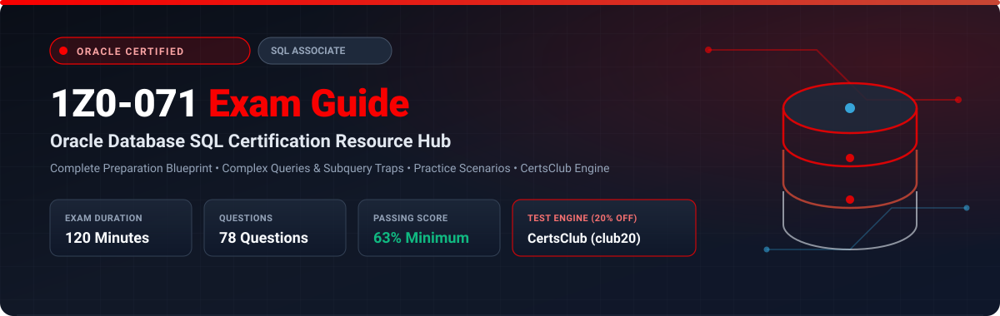

<p align="center">
  
</p>

# Oracle Database SQL (1Z0-071) Exam Study Guide & Practice Test Resource Portal

[-f80000?style=for-the-badge&logo=oracle&logoColor=white)](https://education.oracle.com/)
[](https://education.oracle.com/)
[](https://education.oracle.com/)
[](https://education.oracle.com/)
[](https://education.oracle.com/)
[-28a745?style=for-the-badge&logo=shield)](https://www.certsclub.com/oracle/)

---

## 1. Exam Overview & Candidate Profile

The **Oracle Database SQL (1Z0-071)** exam validates a candidate's comprehensive understanding of fundamental SQL concepts and practical competence in writing queries against an Oracle Database. Achieving this credential proves that you possess the skills required to query relational databases, perform complex data manipulation (DML), design and manage database schema objects (DDL), control transactions, and implement security and constraint architectures.

Passing the 1Z0-071 exam awards the globally recognized **Oracle Database SQL Certified Associate** certification. It serves as a foundational milestone for advanced credentials, including Oracle Database Administrator Certified Professional (OCP DBA) and Oracle Cloud Database Services Specialist tracks.

### Target Candidate Profile & Career Roles
* **Database Developers & SQL Programmers**
* **Database Administrators (DBAs) & Data Engineers**
* **Data Analysts & Business Intelligence Developers**
* **Application Developers (Java, Python, C#, PL/SQL)**
* **Prerequisites:** While there are no mandatory prerequisites, candidates benefit substantially from practical experience querying Oracle databases (19c / 21c / 23ai) and managing table structures.

---

## 2. Key Exam Specifications

| Parameter | Official Specification |
| :--- | :--- |
| **Exam Code** | 1Z0-071 |
| **Exam Title** | Oracle Database SQL |
| **Certification Earned** | Oracle Database SQL Certified Associate |
| **Exam Duration** | 120 Minutes |
| **Number of Questions** | 78 Questions |
| **Passing Score** | 63% |
| **Format** | Multiple Choice (Single and Multiple Select) |
| **Testing Engine & Delivery** | Pearson VUE / Oracle University Online Proctoring |
| **Recommended Practice Test Engine** | **[1Z0-071 Practice Test - CertsClub](https://www.certsclub.com/oracle/)** (Discount Coupon: `club20` for 20% off) |

---

## 3. Official Blueprint & Exam Domain Breakdown

| Domain Code | Exam Domain Title | Weighting | Key Competencies & Objectives |
| :--- | :--- | :---: | :--- |
| **1.0** | **Relational Database Concepts & SQL Fundamentals** | **10%** | Theoretical relational model, primary/foreign keys, entity relationship modeling, SQL statement types (DML, DDL, DCL, TCL), basic SELECT syntax, arithmetic expressions, and operator precedence. |
| **2.0** | **Restricting, Sorting, and Single-Row Functions** | **15%** | WHERE clause filtering, comparison operators (`=`, `<>`, `BETWEEN`, `IN`, `LIKE`, `IS NULL`), logical operators (`AND`, `OR`, `NOT`), ORDER BY sorting, NULL precedence, character functions (`SUBSTR`, `INSTR`, `LENGTH`, `REPLACE`), numeric functions (`ROUND`, `TRUNC`, `MOD`), and date arithmetic. |
| **3.0** | **Conversion Functions and Conditional Expressions** | **10%** | Implicit vs explicit conversion, `TO_CHAR`, `TO_NUMBER`, `TO_DATE` with format masks, `NVL`, `NVL2`, `NULLIF`, `COALESCE`, and conditional logic via `CASE` expressions and `DECODE`. |
| **4.0** | **Aggregation, Grouping, and Reporting Data** | **12%** | Group functions (`COUNT`, `SUM`, `AVG`, `MIN`, `MAX`), handling NULLs in aggregations, `GROUP BY`, filtering with `HAVING`, and advanced grouping with `ROLLUP`, `CUBE`, and `GROUPING SETS`. |
| **5.0** | **Displaying Data from Multiple Tables Using Joins** | **15%** | ANSI/ISO SQL join syntax vs Oracle proprietary syntax, Natural Joins, `JOIN ... ON`, `JOIN ... USING`, Equijoins, Nonequijoins, Self Joins, Outer Joins (`LEFT`, `RIGHT`, `FULL OUTER JOIN`), and Cartesian products (`CROSS JOIN`). |
| **6.0** | **Subqueries & Advanced Query Techniques** | **15%** | Single-row subqueries, multiple-row subqueries (`IN`, `ANY`, `ALL`), handling NULL values in subqueries (the `NOT IN` pitfall), correlated subqueries, `EXISTS` and `NOT EXISTS` operators, and scalar subqueries. |
| **7.0** | **SET Operators** | **8%** | `UNION`, `UNION ALL`, `INTERSECT`, and `MINUS` operators, guidelines regarding column counts, data type compatibility, sorting restrictions, and performance tradeoffs. |
| **8.0** | **Data Manipulation Language (DML) & Transaction Control** | **15%** | `INSERT`, `UPDATE`, `DELETE`, `MERGE` statement architecture, multi-table inserts (`INSERT ALL`, `INSERT FIRST`, conditional/unconditional), transaction boundaries, `COMMIT`, `ROLLBACK`, `SAVEPOINT`, and statement-level rollbacks. |

---

## 4. Deep Dive into Complex & High-Yield Exam Topics

### 4.1 The `NOT IN` with NULL Values Trap
A frequent exam question focuses on multiple-row subqueries returning NULLs:
```sql
-- If the subquery returns any NULL value:
SELECT employee_id, last_name 
FROM employees 
WHERE employee_id NOT IN (SELECT manager_id FROM employees);
```
* **Mechanics:** `NOT IN (val1, val2, NULL)` expands to `employee_id <> val1 AND employee_id <> val2 AND employee_id <> NULL`.
* **The Result:** In SQL ternary logic, `ANY_VALUE <> NULL` evaluates to `UNKNOWN`. When chained with `AND`, the entire WHERE clause evaluates to `UNKNOWN` (falsy), returning **zero rows**!
* **Remediation:** Always filter out nulls in the subquery (`WHERE manager_id IS NOT NULL`) or use `NOT EXISTS`.

### 4.2 The `MERGE` Statement Mechanics
The `MERGE` (upsert) statement combines conditional INSERT, UPDATE, and DELETE operations into an atomic execution:
```sql
MERGE INTO target_table t
USING source_table s
ON (t.id = s.id)
WHEN MATCHED THEN
  UPDATE SET t.val = s.val, t.status = s.status
  DELETE WHERE (t.status = 'INACTIVE')
WHEN NOT MATCHED THEN
  INSERT (t.id, t.val, t.status)
  VALUES (s.id, s.val, s.status);
```
* **Critical Rule:** You cannot update columns referenced in the `ON` join condition clause. Attempting to do so raises `ORA-38104: Columns referenced in the ON Clause cannot be updated`.
* The `DELETE` clause inside `WHEN MATCHED` only cleans up rows that were **touched by the UPDATE operation** and satisfy the delete condition.

### 4.3 Advanced Grouping: `ROLLUP`, `CUBE`, and `GROUPING SETS`
* **`ROLLUP(a, b, c)`**: Generates hierarchical subtotal aggregations:
  * `(a, b, c)`
  * `(a, b)`
  * `(a)`
  * `()` (Grand Total)
  * Total combinations = $N + 1$ (for 3 columns: $3 + 1 = 4$ groupings).
* **`CUBE(a, b, c)`**: Generates cross-tabular aggregations across all possible permutations ($2^N = 2^3 = 8$ groupings).
* **`GROUPING SETS( (a, b), (c) )`**: Computes precisely specified aggregations without unnecessary subtotal computations, minimizing I/O overhead.

---

## 5. Scenario-Based Demo Questions & Technical Explanations

### Question 1: Conditional Logic and Character Functions
**Scenario:** An application developer needs to display employee bonuses based on department assignment:
* Employees in department 10 receive a 10% bonus.
* Employees in department 20 receive a 15% bonus.
* All other employees receive a 5% bonus.
The query must output `NO BONUS` if the calculated bonus is `NULL`.

Which SQL statement achieves this requirement accurately?

A)
```sql
SELECT employee_id,
       NVL(TO_CHAR(CASE department_id
                     WHEN 10 THEN salary * 0.10
                     WHEN 20 THEN salary * 0.15
                     ELSE salary * 0.05
                   END), 'NO BONUS') AS bonus
FROM employees;
```

B)
```sql
SELECT employee_id,
       DECODE(department_id, 10, salary * 0.10, 20, salary * 0.15, salary * 0.05, 'NO BONUS') AS bonus
FROM employees;
```

C)
```sql
SELECT employee_id,
       NVL(CASE department_id
             WHEN 10 THEN salary * 0.10
             WHEN 20 THEN salary * 0.15
             ELSE salary * 0.05
           END, 'NO BONUS') AS bonus
FROM employees;
```

D)
```sql
SELECT employee_id,
       NULLIF(CASE department_id
                WHEN 10 THEN salary * 0.10
                WHEN 20 THEN salary * 0.15
                ELSE salary * 0.05
              END, 0) AS bonus
FROM employees;
```

**Correct Answer:** **A**

**Detailed Explanation:**
* In option **C**, the `NVL(expr1, expr2)` function requires `expr1` and `expr2` to have compatible data types. `expr1` evaluates to a numeric value (`salary * 0.10`), while `expr2` is a character literal (`'NO BONUS'`). Because Oracle attempts implicit conversion of `'NO BONUS'` to a number, this statement raises `ORA-01722: invalid number`.
* Option **A** correctly wraps the numeric calculation inside `TO_CHAR()`, converting the result to a string before passing it into `NVL()`.
* Option **B** uses `DECODE` with inconsistent data types in return values and invalid parameter counts.
* Option **D** uses `NULLIF`, which returns `NULL` when two expressions are equal, rather than replacing nulls.

---

### Question 2: Multi-Table Joins & Outer Join Filtering
**Scenario:** You execute the following query to list all departments and their associated employees:
```sql
SELECT d.department_name, e.last_name
FROM departments d
LEFT OUTER JOIN employees e
  ON d.department_id = e.department_id
WHERE e.salary > 5000;
```
What is the outcome of executing this query?

A) It returns all departments, including departments without any employees, and lists employees earning more than 5000.  
B) It effectively converts the `LEFT OUTER JOIN` into an `INNER JOIN`, excluding departments that have no employees or where employees do not earn more than 5000.  
C) It generates `ORA-00918: column ambiguously defined`.  
D) It returns all departments, showing `NULL` for `last_name` whenever an employee earns 5000 or less.  

**Correct Answer:** **B**

**Detailed Explanation:**
* When a filter condition on the right (preserved/optional) table of a `LEFT OUTER JOIN` is placed in the `WHERE` clause instead of the `ON` clause, rows where the right table returned `NULL` are evaluated as `NULL > 5000` (which evaluates to `UNKNOWN`).
* As a result, all outer-joined rows where no employee exists are filtered out, effectively converting the outer join into an **Inner Join**.
* To preserve all departments while filtering employees, the condition must be placed directly inside the `ON` clause:
```sql
SELECT d.department_name, e.last_name
FROM departments d
LEFT OUTER JOIN employees e
  ON d.department_id = e.department_id AND e.salary > 5000;
```

---

## 6. Recommended Preparation Strategy & Practice Testing Engine

To clear the Oracle 1Z0-071 exam on your first attempt, follow a balanced preparation methodology combining theoretical mastery, hands-on SQL execution, and full-length exam simulations:

1. **Hands-On SQL Practice:** Provision a free Oracle Autonomous Database instance on Oracle Cloud Infrastructure (OCI) or install Oracle Database Express Edition (XE / 23ai Free). Write and execute every single syntax variation locally.
2. **Master Format Masks and Data Types:** Spend focused time testing edge cases with `TO_DATE`, `TO_TIMESTAMP`, `INTERVAL`, and conversion masks.
3. **Practice Full-Length Timed Mocks:** Real-world exam pressure differs significantly from casual study. We recommend using **[CertsClub Oracle Practice Tests](https://www.certsclub.com/oracle/)** as your primary exam simulator.
   * **Real Exam Simulation:** Experience genuine multi-select question formats and tricky syntax scenarios.
   * **In-Depth Explanations:** Review comprehensive answer rationales covering why correct options are right and incorrect options fail.
   * **Exclusive Community Discount:** Use coupon code **`club20`** at checkout on [CertsClub](https://www.certsclub.com/oracle/) for an immediate 20% discount on all Oracle exam packages.

---

## 7. Official Documentation & References

* [Oracle Database SQL Language Reference 19c / 21c / 23ai](https://docs.oracle.com/en/database/oracle/oracle-database/)
* [Oracle University 1Z0-071 Certification Track](https://education.oracle.com/)
* [CertsClub Oracle Certification Exam Practice Engine](https://www.certsclub.com/oracle/)
* [Oracle Live SQL Interactive Platform](https://livesql.oracle.com/)

---

## 8. SEO & Discovery Keywords
```
1z0-071, 1z0-071 dumps, 1z0-071 exam questions, 1z0-071 practice test, oracle database sql certified associate,
oracle 1z0-071 study guide, certsclub 1z0-071, oracle sql exam questions, 1z0-071 pdf, oracle certification,
oracle ocp sql, sql single row functions, oracle join syntax, rollup cube grouping sets, oracle merge statement
```
